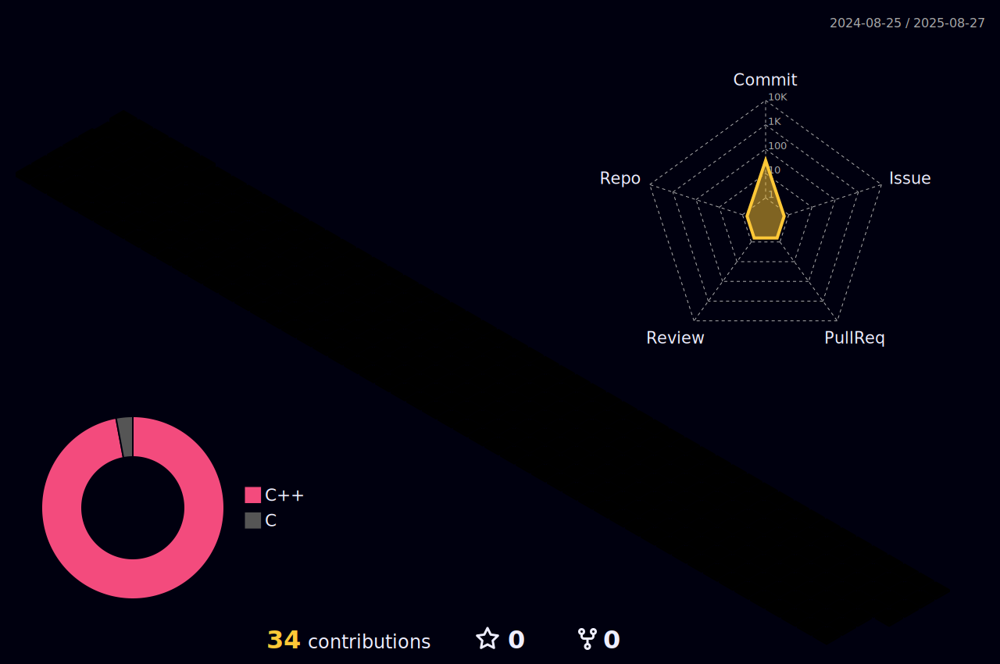

# 💫 About Me:
I am a student, currently learning C++/Linux, hope to find a favorite job after graduation.

## 🌐 Socials and Tech Stack 💻 :
 
 
 
 
 
 

  
  
  <picture>
  <source media="(prefers-color-scheme: dark)" srcset="https://github.com/Pingquan2024/Pingquan2024/blob/output/github-contribution-grid-snake-dark.svg" />
  <source media="(prefers-color-scheme: light)" srcset="https://github.com/Pingquan2024/Pingquan2024/blob/output/github-contribution-grid-snake.svg" />
  
</picture>

# 📊 GitHub Stats:
<!--  -->

  
  
  

<!--  -->

<!--  -->

## 🏆 GitHub Trophies

---

<!-- Proudly created with GPRM ( https://gprm.itsvg.in ) -->
